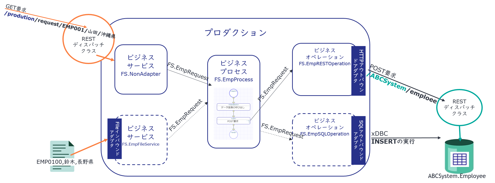

# IRISのInteroperabilityを利用したサンプル（RESTで情報入力／RESTでPOST要求）

**サンプルプロダクション概要**



**サンプルのテーマ**

***
ある会社に新社内システム（ABCSystem）が導入され、利用申請を済ませた社員情報を自動的に新システムに登録するようにしたいと考えました。

新システムは REST API とテーブルが公開されています。 

利用申請画面から、REST APIを利用して登録できたら？と考えましたが、新システムに必要な情報が不足していることに気が付きました。

ということで、IRISのInteroperabilityを利用して、REST経由で送付される情報に不足する情報を追加し、新システムのREST APIに送信することにしました。
***

サンプルには、テーマに合わせて以下のコンポーネント用クラス、REST API用クラス、永続クラス定義が含まれています。

|内容|コンポーネント名（クラス名）|
|:--|:--|
|GET要求を受け付けるREST API（RESTディスパッチクラス）|[FS.REST](src/FS/REST.cls)|
|RESTディスパッチクラスから呼び出されるサービス|[FS.NonAdapter](src/FS/NonAdapter.cls)|
|Area情報を取得するデータ変換を呼び出すプロセス|[FS.EmpProcess](src/FS/EmpProcess.cls)|
|Area情報を作成するデータ変換|[FS.LocationToAreaDTL](src/FS/LocationToAreaDTL.cls)|
|ABCSystemへPOST要求を行うオペレーション|[FS.EmpRESTOperation](src/FS/EmpRESTOperation.cls)|
|ABCSystemのREST API（RESTディスパッチクラス）|[ABCSystem.REST](src/ABCSystem/REST.cls)|
|ABCSystemのEmployeeテーブル（永続クラス）|[ABCSystem.Employee](src/ABCSystem/Employee.cls)|
|コンポーネント間データ送受信に使うメッセージ|[FS.EmpRequest](src/FS/EmpRequest.cls)|
|（おまけ）ファイルからの入力を受け付けるサービス|[FS.EmpFileService](src/FS/EmpFileService.cls)|
|（おまけ）SQLによるABCSystem.Employeeの更新を行うオペレーション|[FS.EmpSQLOperation](src/FS/EmpSQLOperation.cls)|
|プロダクション設定が保存されたクラス定義（設定は管理ポータルから行います）|[FS.EmpProduction](src/FS/EmpProduction.cls)|


## コンテナ開始までの手順

**Linux でお試しいただく場合は [start.sh](./start.sh) を実行してください。**

*Windowsでお試しいただく場合は [start.bat](./start.bat)を実行してください。*

コンテナ詳細は、[docker-compose.yml](./docker-compose.yml) をご参照ください。

Git展開後、**./in は コンテナ内 /ISC/in ディレクトリをマウントしています。**

また、IRIS for Health の管理ポータル起動に使用する Web サーバポートは 52779 が割り当てられています。

既に使用中ポートの場合は、[docker-compose.yml](./docker-compose.yml) の **13行目** を修正してご利用ください。

**≪52779に割り当てる例≫　- "52779:52773"**


### コマンド実行例

1) git clone

```
git clone https://github.com/Intersystems-jp/TryIRISInteroperability
```

2) cloneしたディレクトリに移動

```
cd TryIRISInteroperability
```

3) コンテナ開始の為、[start.sh](./start.sh) または [start.bat](./start.bat) を実行

*Linux*
```
$ ./start.sh
```

*windows*
```
> ./start.bat
```


**コンテナを停止する方法**

```
$ docker-compose stop
```


**コンテナを破棄する方法（コンテナを消去します）**

**注意：コンテナを破棄するとIRISで作成した定義やデータも全て破棄されます**

```
$ docker-compose down
```

## サンプルの動かし方

以下の GET 要求を実行するとサービス：[FS.NonAdapter](src/FS/NonAdapter.cls)に情報が渡され、Areaに適切な値を設定し、[ABCSystem.Employee](src/ABCSystem/Employee.cls)テーブルを更新します。


以下の順序で入力情報を指定します。

http://localhost:52779/production/request/従業員番号/名前/勤務地


GET 要求例） http://localhost:52779/production/request/EMP0999/田口花子/北海道

**Curlコマンドでの実行**
```
curl http://localhost:52779/production/request/EMP0999/田口花子/北海道

```


ABCSystem.Employeeが更新されたか、管理ポータルのSQL画面（管理ポータル > システムエクスプローラ > SQL）から確認することもできますが、以下のGET要求で確認することもできます。

ABCSystem.Employeeを全件返すGET要求）

http://localhost:52773/ABCSystem/employee

**Curlコマンドでの実行**
```
curl http://localhost:52773/ABCSystem/employee

```